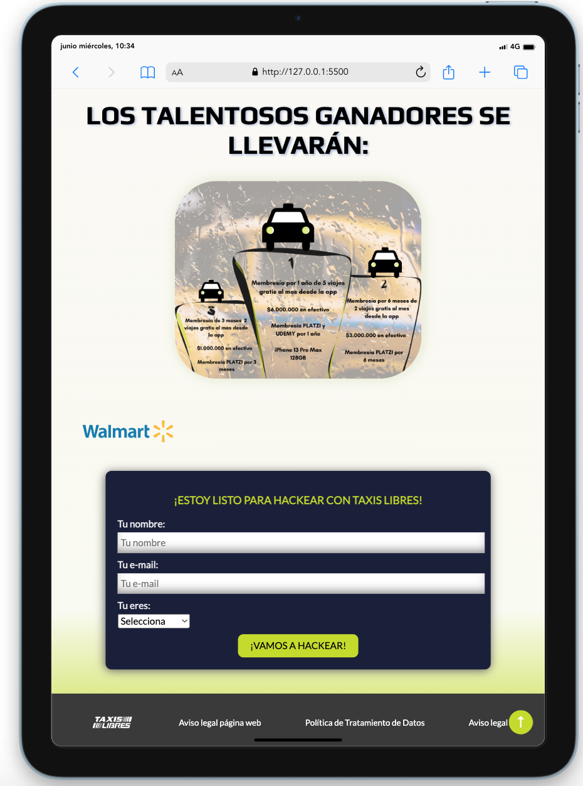

# TaxiCode Hackathon Taxis Libres

### Proyecto
Prototipo de landing page para la próxima hackathon 2023 de *Taxis libres*.

### Objetivo
Crear una landing page que cumpla con las estandarizaciones de la misma, que permita tener información clara y precisa del evento y persuada al posible participante a hacer parte de esta excelente oportunidad de crecimiento.

### Prototipo de alta fidelidad
Se planifica el diseño por medio de un prototipo de alta fidelidad realizado en figma y que puede ser verificado a continuación:

## Proyecto finalizado
A continuación el proyecto finalizado, se agregan diversos elementos con el fin de cubrir a cabalidad con los requerimientos, asi mismo, se incluyen elementos como el title del head y el icono de la marca para facilitar el SEO:

### Referencias y créditos
- Todo el diseño está inspirado en la marca *Taxis libres*, respetando su gama de colores y diseño institucional.
- Imágenes de logos se toman de la página web oficial de *Taxis Libres*.
- Imágenes de la sección de información ubicadas con ayuda de la herramienta Google Lens.
- Diseño propio en la sección de premiaciones.
- Los sponsors de este proyecto son netamente ficticios y se usan solo para recrear la landing page.
